<!-- README.md is generated from README.Rmd. Please edit that file -->

# ggclassify

**ggclassify** extends
[**ggplot2**](https://github.com/tidyverse/ggplot2) providing functions
to visualize the decision spaces of classification and clustering
methods. **ggclassify** currently includes the functions
`geom_classify()` and `geom_classify_boundary()` for plotting the
classification regions through filling in the regions, or outlining the
resulting boundaries respectively.

## Installation

You can install the latest development version of **ggclassify** from
[GitHub](https://github.com/) with:

``` r
if (!requireNamespace("remotes")) install.packages("remotes")
remotes::install_github("nathaniel-morgan/ggclassify")
```

## `geom_classify()`

The common classification method used is LDA, below is how you can
visualize the decision space using `geom_classify()`

``` r
library("ggplot2"); theme_set(theme_minimal())
theme_update(panel.grid.minor = element_blank())
library("ggclassify")
library("patchwork")

set.seed(17)

df <- data.frame(x = rnorm(40), y=rnorm(40) + 2, class = factor("A")) |> 
  rbind(data.frame(x = rnorm(40, sd=2) + 2, y=rnorm(40, sd = 2) - 1, class = factor("B"))) |> 
  rbind(data.frame(x = rnorm(40, sd=1/2) + 2, y=rnorm(40, sd = 1/2) + 1,class = factor("C")))

df |> ggplot(aes(x, y, fill = class))+
  geom_classify(method = "lda")+
  geom_point(aes(col = class), alpha = 2/3)
```

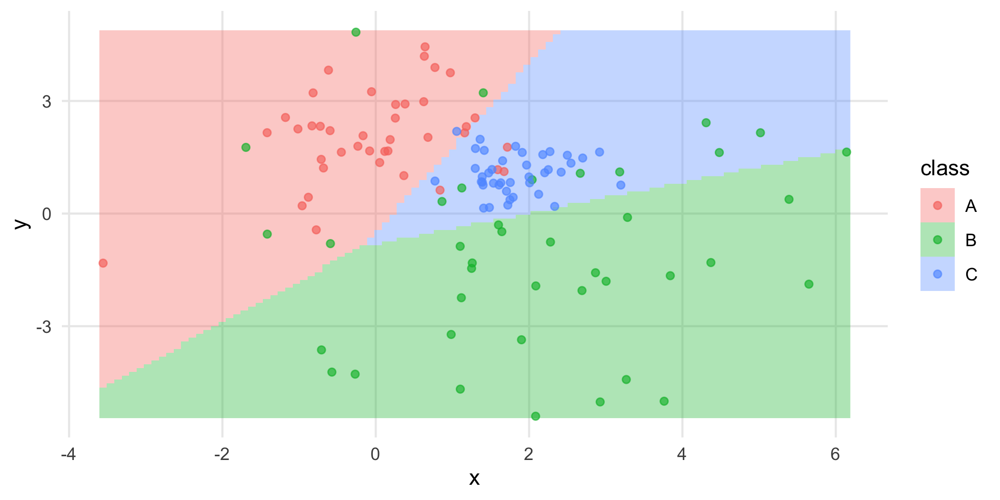

To visualize QDA instead you only need to change the method used.

``` r
df |> ggplot(aes(x, y, fill = class))+
  geom_classify(method = "qda")+
  geom_point(aes(col = class), alpha = 2/3)
```

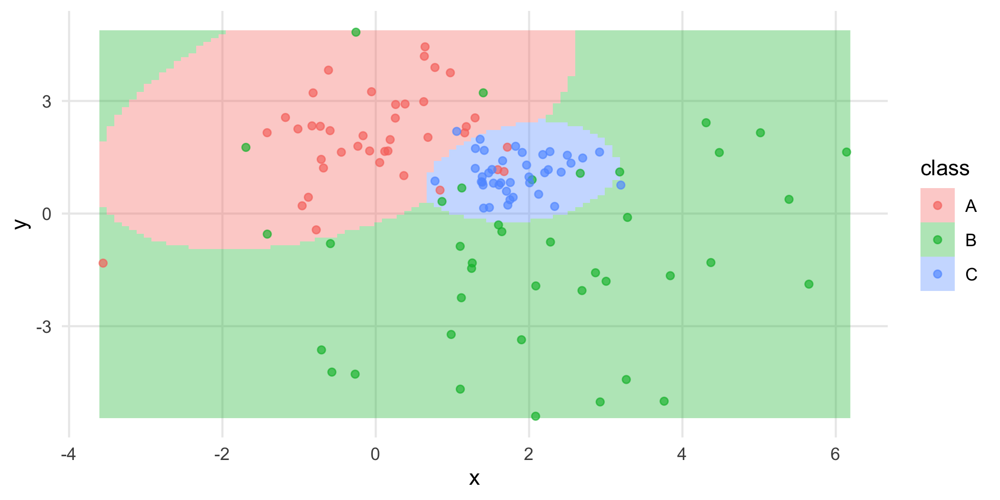

Placing them side by side can easily compare how different methods
partition the decision space with the same data.

``` r
df |> ggplot(aes(x, y, fill = class))+
  geom_classify(method = "lda")+
  geom_point(aes(col = class), alpha = 2/3)+
  ggtitle("LDA")+
df |> ggplot(aes(x, y, fill = class))+
  geom_classify(method = "qda")+
  geom_point(aes(col = class), alpha = 2/3)+
  ggtitle("QDA")+
  theme(axis.text.y=element_blank(),
      axis.title.y=element_blank())+
  plot_layout(guides = "collect")
```

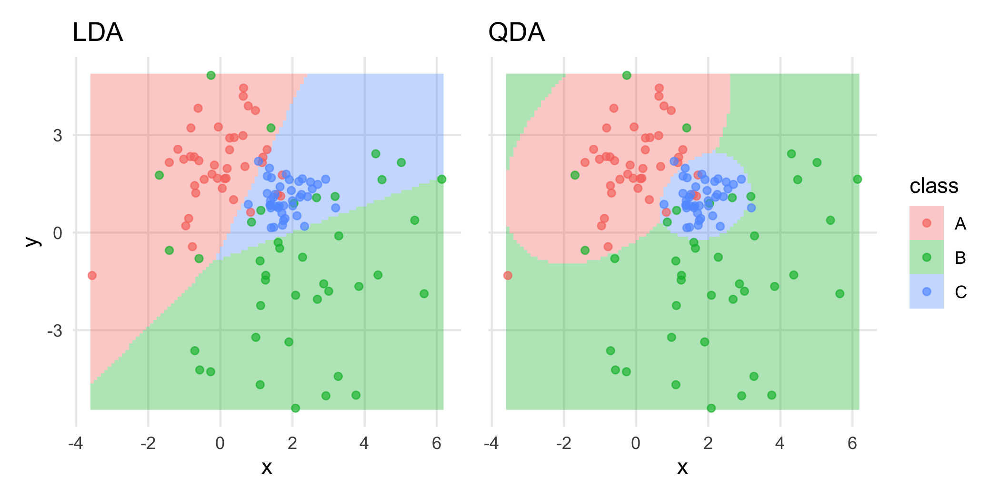

`geom_classify()` has four built in methods (LDA,QDA,KNN, and Random
Forest), but can also take tidymodel objects for methods.

``` r
library(tidymodels)
library(discrim)

mn_mod <- multinom_reg() |> 
  set_engine("nnet") |> 
  set_mode("classification")

df |> ggplot(aes(x, y, fill = class))+
  geom_classify(method = mn_mod)+
  geom_point(aes(col = class), alpha = 2/3)+
  ggtitle("Multinomial Regression")
```

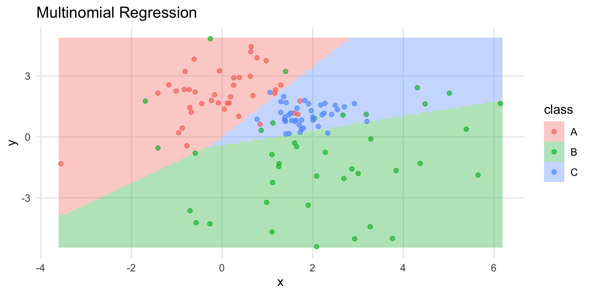

``` r

naive_mod <- naive_Bayes() |>  
  set_mode("classification") |>  
  set_engine("klaR") |> 
  set_args(usekernel = FALSE)

df |> ggplot(aes(x, y, fill = class))+
  geom_classify(method = naive_mod)+
  geom_point(aes(col = class), alpha = 2/3)+
  ggtitle("Naive Bayes")
```

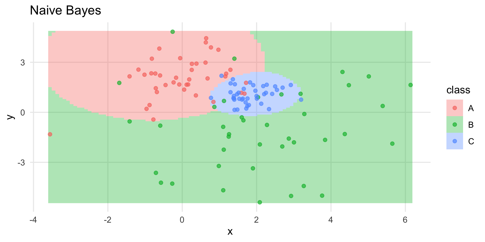

There is also the option to have the fill fade awat from the boundary as
opposed to being the same alpha level across the entire region by
setting `fade = TRUE`. This could make it a bit easier to see any points
plotted.

``` r
df |> ggplot(aes(x, y, fill = class))+
  geom_classify(method = "lda", fade = TRUE)+
  geom_point(aes(col = class), alpha = 2/3)+
  ggtitle("Fade Plot")
```

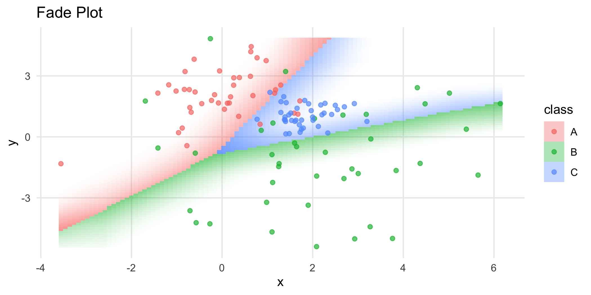

You can also write your own custom function to be plugged into
geom_classify so long as they are a function of the data and mesh, and
then return a mesh with a fill variable that contains the class for the
class of each point. Below is a very simple custom function that merely
checks if they are within 4 distance of the center.

``` r
custom_method <- function(data,mesh){
  mesh$fill <- factor(mesh$x^2+mesh$y^2 < 4)
  return(mesh)
}

df |> ggplot(aes(x, y, fill = class))+
  geom_classify(method = custom_method)+
  geom_point()+
  coord_equal()
```

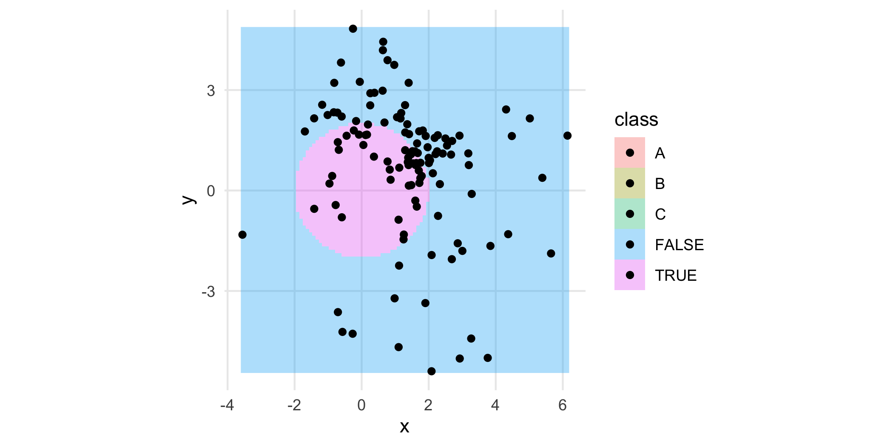

By default a rectangle defined by the most extreme points will be
classified, but a custom mesh of points to be checked can be supplied
instead.

``` r
custom_mesh <- expand.grid(x=seq(-10,10,by=0.1),y=seq(-10,10,by=0.1))

df |> ggplot(aes(x, y, fill = class))+
  geom_classify(method = "qda", mesh = custom_mesh)+
  geom_point(aes(col = class))+
  coord_equal()
```


If you don’t want to change the dimensions, but want to plot a higher
density of points to get a higher resolution of the classification space
you can adjust the resolution to be higher than the default 101 x 101.
Warning, this can greatly increase the computational time.

``` r
df |> ggplot(aes(x, y, fill = class))+
  geom_classify(method = "qda", res = 11)+
  geom_point(aes(col = class))
```

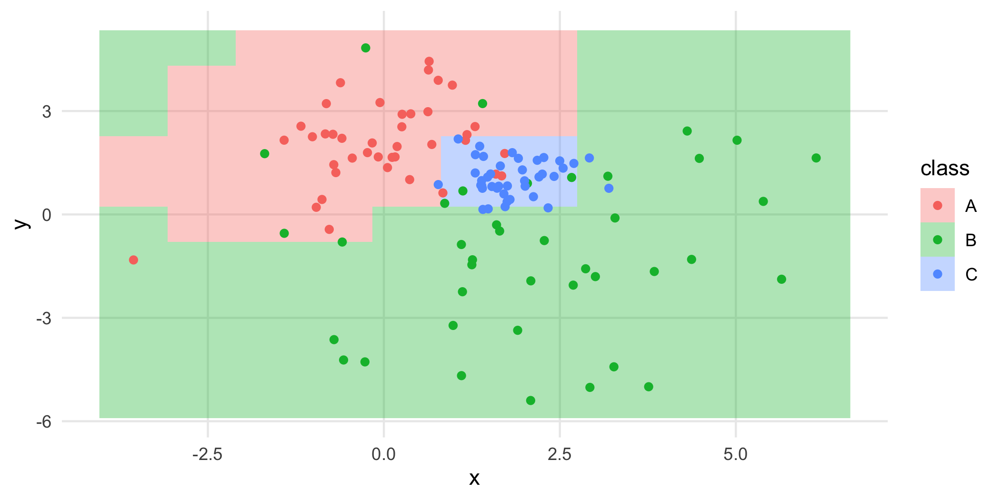

``` r

df |> ggplot(aes(x, y, fill = class))+
  geom_classify(method = "qda", res = 1001)+
  geom_point(aes(col = class))
```

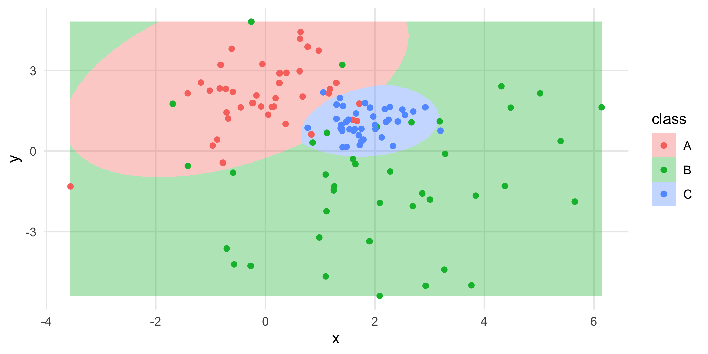

## `geom_classify_boundary()`

If all you want is the boundary between different classes
`geom_classify_boundary()` will only plot the boundaries and takes the
same arguments as `geom_classify()`

``` r
df |> ggplot(aes(x, y, fill = class))+
  geom_classify_boundary(method = "lda")+
  geom_point(aes(col = class))
```


``` r

df |> ggplot(aes(x, y, fill = class))+
  geom_classify_boundary(method = "qda")+
  geom_point(aes(col = class))
```

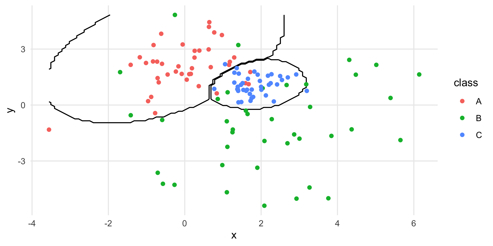

To make the boundary less jagged there is the option to use a kernel
density smoother on the boundaries by setting `smooth = TRUE`. The
bandwidth of the smoother can also be adjusted with `bandwidth` which is
defaulted to `1/2`. Too large of a bandwidth can however skew the
boundary to become inaccurate.

``` r
df |> ggplot(aes(x, y, fill = class))+
  geom_classify_boundary(method = "lda", smooth = TRUE)+
  geom_point(aes(col = class))
```

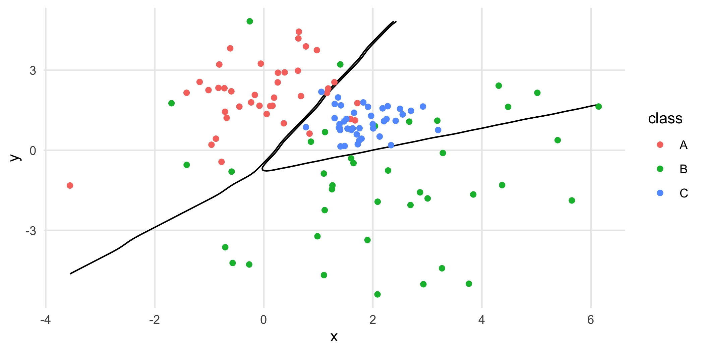

``` r

df |> ggplot(aes(x, y, fill = class))+
  geom_classify_boundary(method = "lda", smooth = TRUE, bandwidth = 1/4)+
  geom_point(aes(col = class))
```


``` r

df |> ggplot(aes(x, y, fill = class))+
  geom_classify_boundary(method = "lda", smooth = TRUE, bandwidth = 4)+
  geom_point(aes(col = class))
```

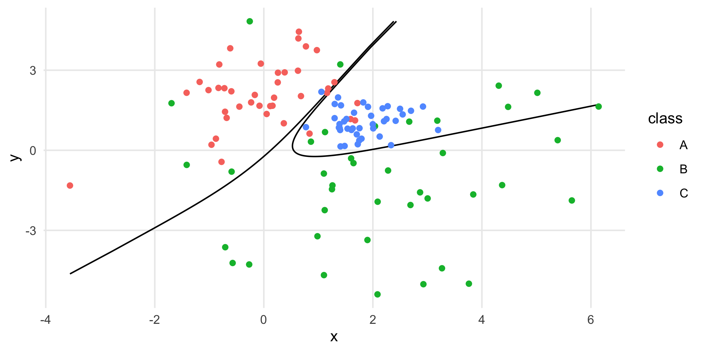

You can combine `geom_classify_boundary()` with `geom_classify()` in one
plot to overlay two different classification methods.

``` r
df |> ggplot(aes(x, y, fill = class))+
  geom_classify(method = "lda")+
  geom_classify_boundary(method = "qda")+
  geom_point(aes(col = class))+
  ggtitle("LDA versus QDA")
```

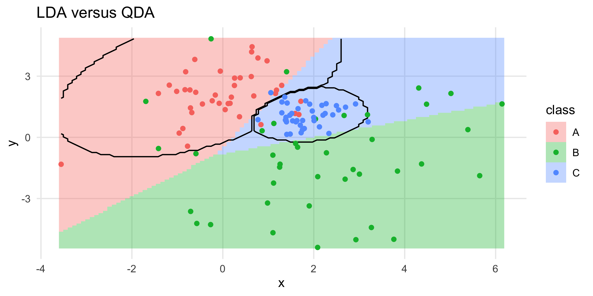

## `classify_multi()`

If you have patchwork loaded `classify_multi()` is a wrapper function
that allows for combining the plots of multiple different methods into
one figure.

``` r
# First create the plot with everything you want minus the classification
simpleplot <- ggplot(df,aes(x,y,fill = class))+
  geom_point_fill()

classify_multi(simpleplot,methods = list("lda","qda","knn","randomForest"))
```

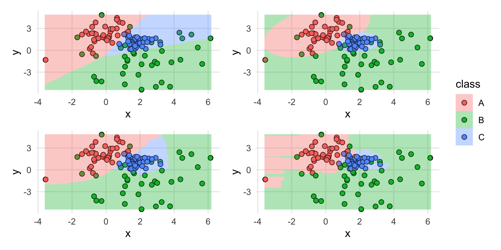

You can get boundary plots instead simply by setting boundary to TRUE.

``` r
classify_multi(simpleplot,methods = list("lda","qda","knn","randomForest"),
               boundary = TRUE)
```

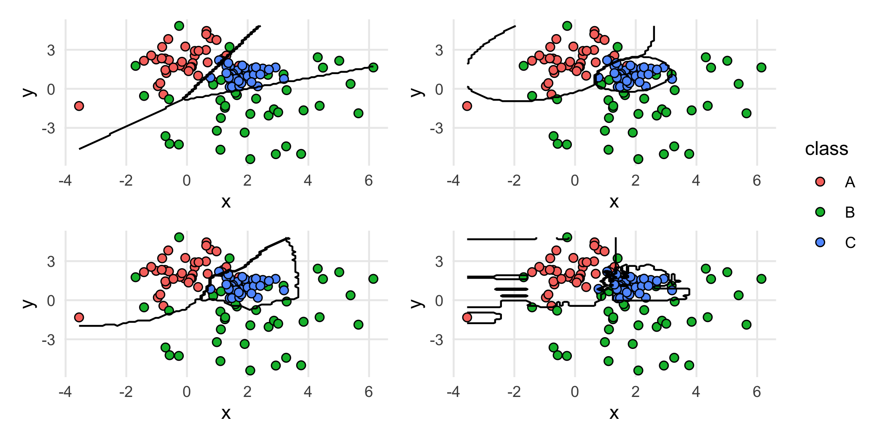

Geom arguments like `smooth` or `fade` can also be passed in.

``` r
classify_multi(simpleplot,methods = list("lda","qda","knn","randomForest"),
               boundary = TRUE, smooth = TRUE)
```

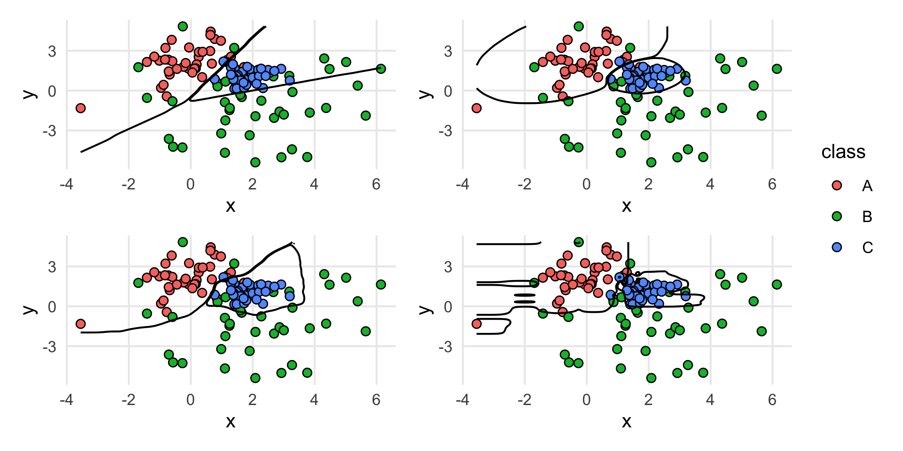

``` r

classify_multi(simpleplot,methods = list("lda","qda","knn","randomForest"),
               fade = TRUE)
```

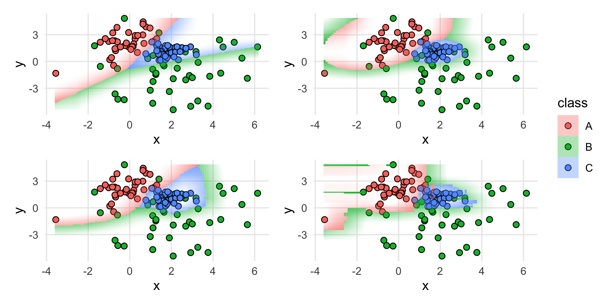

A vector of titles can also be supplied to give each plot a title.

``` r
classify_multi(simpleplot,methods = list("lda","qda","knn","randomForest"),
               titles = c("LDA","QDA","K Nearest Neighbors","Random Forest"))
```

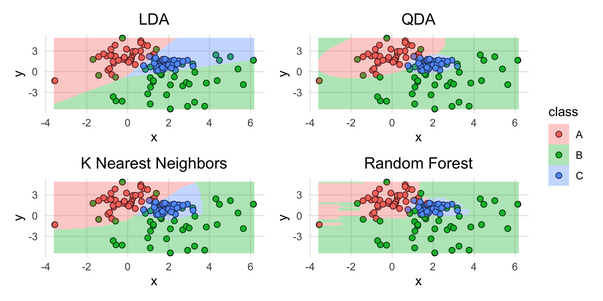

This works for any sort of method, and additional arguments supplied
will be added to the classification geom.

``` r
classify_multi(simpleplot,methods = list(custom_method,naive_mod,"knn","randomForest"),
               titles = c("Custom Circle Function","Naive Bayes","K Nearest Neighbors","Random Forest"),
               boundary = TRUE,res = 201)
```

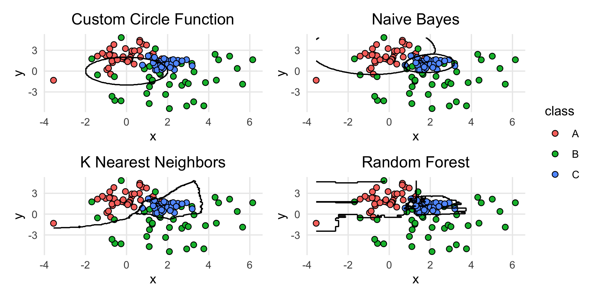

## TidyClust

You are also able to use objects from the new TidyClust package for
unsupervised classification.

``` r
library(tidyclust) 

kmeans_spec <- k_means(num_clusters = 3) |>
  set_engine("stats") 

ggplot(df, aes(x,y))+
  geom_classify(method = kmeans_spec)+
  geom_point()
```

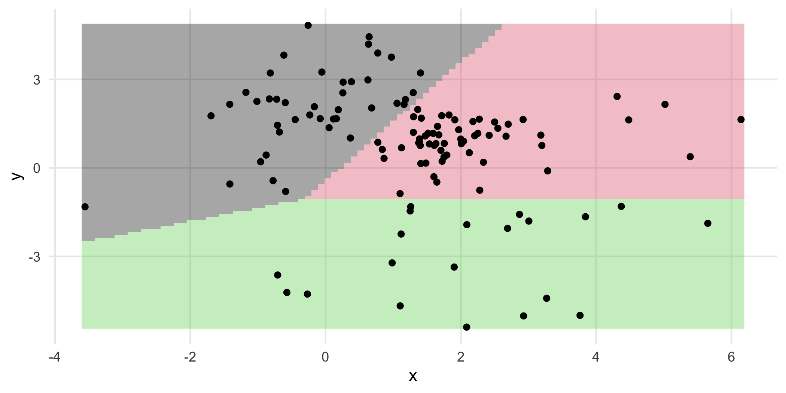
