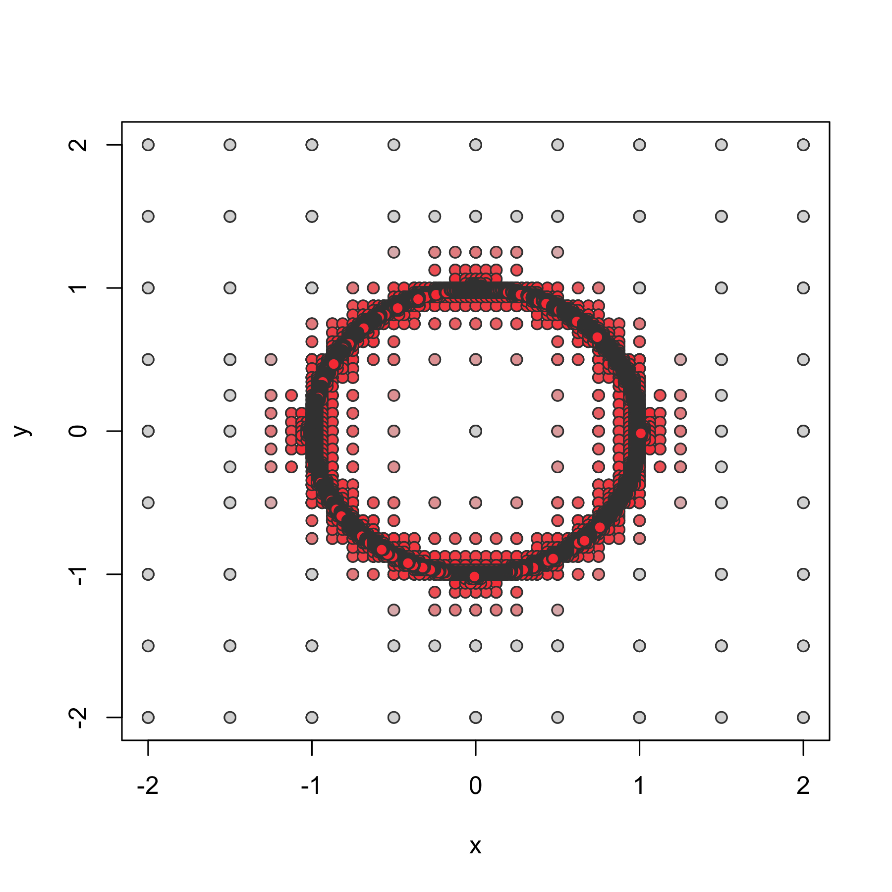

<!-- README.md is generated from README.Rmd. Please edit that file -->

# biroot

**Note: this package is currently under construction. You should not use
it.**
<!-- extends [**ggplot2**](https://github.com/tidyverse/ggplot2) providing -->
<!-- functions to visualize the decision spaces of classification and clustering methods. -->
<!-- **ggclassify** currently includes the functions `geom_classify()` and `geom_classify_boundary()` for plotting the classification regions through filling in the regions, or outlining the resulting -->
<!-- boundaries respectively. -->

## Basic usage

**biroot** supplies tools for finding the one dimensional root of a
function of two variables over a fixed rectangular spatial extent. For
example, if $f(x,y) = x^{2} + y^{2} - 1$ is the function of interest and
$\mathcal{D} = [-2,2] \times [-2,2] \subset \mathbb{R}^{2}$ is the
spatial extent, the goal of these tools would be to find that the set
$\{(x,y) \in \mathcal{D}: f(x,y) = 0\}$ is the unit circle and provide a
data frame parameterizing points on it.

A few notes are worth mentioning.

1.  As is typical in R, the function $f(x,y)$ is not implemented as
    `f(x,y)` but rather `f(v)`, where `v = c(x,y)`.
2.  Points $(x,y)$ such that $f(x,y) = 0$ are referred to as *solutions
    of $f$*, and the collection of such points is the level set of $f$
    at $0$. For an arbitrary $f$, the level set of $f$ at $0$ can be
    quite complicated: it can have isolated solutions (“0d” solutions,
    e.g. $f(x,y) = x^{2} + y^{2}$), curves of solutions (“1d” solutions,
    e.g. $f(x,y) = x^{2} + y^{2} - 1$), spatial extents of solutions
    (“2d” solutions, e.g. $f(x,y) = 1[x^{2} + y^{2} \leq 1]$), or no
    solutions (e.g. $f(x,y) = x^{2} + y^{2} + 1$). **biroot** is only
    defined with 1d solutions in mind.
3.  1d solution sets can be complicated. They can be disconnected
    (e.g. $f(x,y) = ((x-2)^{2} + y^{2} - 1)((x+2)^{2} + y^{2} - 1)$),
    unbounded (e.g. $f(x,y) = y - x$), self intersecting
    (e.g. $f(x,y) = (y-x)(y+x)$), or exhibit other cusp-like behavior
    (e.g. $f(x,y) = y^{2} - x^{3}$).

The basic algorithm used in biroot is [the quadtree
algorithm](https://en.wikipedia.org/wiki/Quadtree), of which there are
many variations depending on use casee but here can be seen to be an
adaptive grid search, similar to a 2d analogue of the [bisection
method](https://en.wikipedia.org/wiki/Bisection_method). It has two core
functions:

1.  `biroot()`, which accepts a function `f` and spatial extents `xlim`
    and `ylim` (numeric vectors of length 2). This function is called
    `biroot(f, xlim, ylim)` and returns a data frame of places (`x` and
    `y`) where `f` was evaluated in the Cartesian product of `xlim` and
    `ylim`, the value of the function at those points (`value`), along
    with other information corresponding to the algorithm (`depth`, or
    which scale, and `id`, which rectangle at that scale).
2.  `biroot_lines()` and `biroot_bands()`, made by analogy to
    `isolines()` and `isobands()` from [the **isoband**
    package](https://isoband.r-lib.org) and having a similar data
    structure.

Here is an example of the basic use of these functions.

``` r
library("biroot")

sq <- expand.grid(x = c(-2,2), y = c(-2,2))
ftest <- function(v) with(v, x^2 + y^2 - 1)
df <- biroot(sq, ftest) 
str(df)
#> 'data.frame':    33300 obs. of  5 variables:
#>  $ x    : num  -2 2 -2 2 -2 0 -2 0 -2 0 ...
#>  $ y    : num  -2 -2 2 2 -2 -2 0 0 0 0 ...
#>  $ id   : chr  "0" "0" "0" "0" ...
#>  $ depth: num  0 0 0 0 1 1 1 1 1 1 ...
#>  $ value: num  7 7 7 7 7 3 3 -1 3 -1 ...

color_function <- function(x) {
  # f <- colorRampPalette(c("firebrick1", "gray85", "steelblue1"))(10) |> 
  f <- colorRampPalette(c("gray85", "firebrick1", "gray85"))(10) |> 
    colorRamp()
  
  threshold_to_interval <- function(x, l, u) l*(x <= l) + x*(l < x & x < u) + u*(x >= u)
  
  rescale <- function(x) (x - min(x)) / (max(x) - min(x))
  
  x |> 
    threshold_to_interval(l = -1, u = 1) |> 
    rescale() |> 
    f() |> 
    apply(1, \(v) rgb(v[1], v[2], v[3], maxColorValue = 255))
}

plot(x, y, bg = color_function(value), pch = 21, col = "gray25") |> 
  with(df, expr = _)
```



## Installation

You can install the latest development version of **ggclassify** from
[GitHub](https://github.com/) with:

``` r
if (!requireNamespace("remotes")) install.packages("remotes")
remotes::install_github("nathaniel-morgan/biroot")
```
